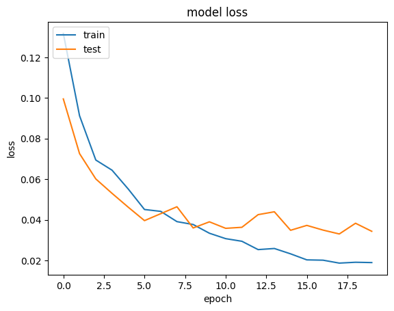

# Doodle Classification

**Real-time classification of user-drawn doodles!**

This project classifies user-drawn doodles in real-time using a Keras model trained on the Google Doodle dataset. Users can draw on a web interface built with p5.js and HTML, and the Flask framework connects the user interface to the Python backend for classification.

### Demo:


### Highlights:

- **Keras Model:** Trained to classify doodles into 5 categories.
- **Real-time Classification:** Users draw, and the model predicts instantly.
- **User Interface (p5.js):** Enables interactive drawing experience.
- **92% Accuracy:** Achieved through training and optimization.

### Setup Instructions:

##### Install Dependencies:

```
pip install -r requirements.txt
```

##### Modify Labels:

The project uses an array named `drawing_lable` in the training script `train.py` to define doodle class labels. Update this array with the specific categories you want your model to classify.

##### Train the Model:

If you want to train a new model, run the training script:

```
python train.py
```

**Modal Parameters:**


**Accuracy vs. Loss Graphs:**




##### Deploy the Model:

- **Copy the Model:** If you trained a new model, copy the model.pkl file from the project directory to the deployed_app folder.
- **Modify Labels (Flask):** run `app.py` file to start the flask app on localhost:5000.
